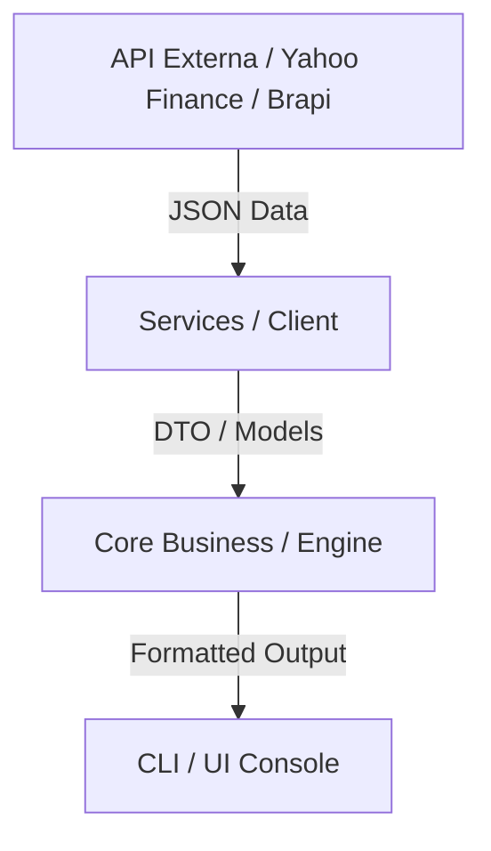

# AssetPulse - Monitor de Investimentos Inteligente

**AssetPulse** é uma aplicação em Python projetada para monitorar cotações, calcular métricas financeiras relevantes (como Dividend Yield e variação diária) e emitir alertas de mercado a partir de APIs públicas.

## Tecnologias Utilizadas
- **Python 3.10+**  
- **Requests / Pydantic** (Integração e validação de dados de APIs)
- **Rich** (Interface estilizada via Terminal)
- **Pytest** (Testes automatizados)

## Arquitetura do Projeto
